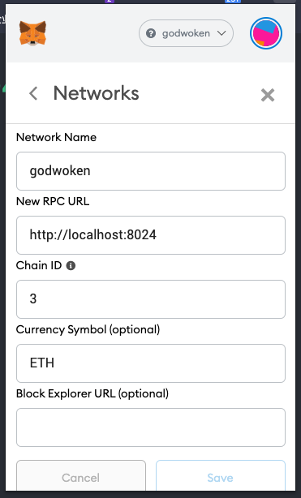

# Godwoken-Kicker

one line command to start godwoken-polyjuice chain for devnet.

## How to run

```md
## quick-mode

use prebuild scripts and binary from docker images, 
fast and simple

## custom-mode

use manual-build scripts and binary via local submodules,
more flexible, for more custom needs

eg: you can use manual mode to debug with
- godwoken
- godwoken-web3
- godwoken-scripts
- godwoken-polyjuice
```

by default, we ship the components with the ***same version*** in both quick-mode(under prebuild-docker-image) and custom-mode(under local submodule folder). you can checkout the specific version information for all components in the release tags descriptions.

### 1. quick mode

make sure you have `docker` and `docker-compose` install on your machine.

```sh
    docker --version
    docker-compose --version
```

clone the code: 

```sh
git clone https://github.com/RetricSu/godwoken-kicker.git
cd godwoken-kicker 
```

when you run first time, or everytime after you change mode, please do:

```sh
make init
```

then you can start godwoken-polyjuice chain by simply running:

```sh
make start
```

you can monitor godwoken and polyjuice backend real-time activities:

```sh
make sp # sp means show polyjuice activities
make sg # sg means show godwoken activities
```

after everything started, check `http://localhost:6100/` to deploy contract.


you will need to change your Metamask network setting like following:

```sh
    Network Name: Godwoken
    New RPC URL: http://localhost:8024
    Chain ID: 0x3
```



### 2. custom mode

#### ***- build custom components on manual***

open `/docker/.build.mode.env` file, under the [mode] section, 
set the component you want to `true`

```sh
####[mode]
MANUAL_BUILD_GODWOKEN=false
MANUAL_BUILD_WEB3=false
MANUAL_BUILD_SCRIPTS=false
MANUAL_BUILD_POLYJUICE=false
```

then run 
```sh
make init
make start
```
and the component will be build and run through submodule on manual.

#### ***- set custom submodule for component***

you can also change different submodule of components if you want. 

by running

```sh
make gen-submodule-env
```

you can have a quick overview about current submodules info at `/docker/.submodule.list.env`:

```sh
####[godwoken]
#info: tags/v0.2.4-0-gdd58925, dd58925 fix(web3-indexer): Transaction data and v format
GODWOKEN_URL=https://github.com/nervosnetwork/godwoken.git
GODWOKEN_BRANCH=master
GODWOKEN_COMMIT=dd58925

####[godwoken-web3]
#info: tags/v0.2.2-0-g0324166, 0324166 Merge pull request #5 from nervosnetwork/fix-bugs
GODWOKEN_WEB3_URL=https://github.com/nervosnetwork/godwoken-web3.git
GODWOKEN_WEB3_BRANCH=main
GODWOKEN_WEB3_COMMIT=0324166

....
```

you can change the submodule info (like remote url/branch/commit) to fetch your own submodule. 

just run the follwoing command after you edit the `/docker/.submodule.list.env` file.

```sh
make update-submodule
``` 

then you can check submodule again to ensure it indeed updated as you want:

```sh
make gen-submodule-env
```

## How to deploy contract

0. ***CHANGE YOUR METAMASK NETWORK to GODWOKEN!***
1. open `http://localhost:6100/`, connect with your metamask address
2. click `Deposit` button to fund some devnet ckb on your metamask address.
3. after deposit finished, 
    - click `Deploy Contract` button
    - select the contract compiled binary file from your computer
    - sign the message with metamask 
   
then the deployment will auto start.

after deployment successfully get done, you will find the contract address listing below.

## How to test dapp

~~read [doc here](docs/test-simple-dapp.md).~~ needs update.

## Some useful command

```sh
make stop # stop the godwoken-polyjuice chain and everything related. (but not remove data) 
```

```sh
make start # start the godwoken-polyjuice chain service.
```

```sh
make start-f # force start. the default command `make start` will not deploy a new godwoken chain if it exits, use start-f if you want to deploy a new chain.
```

```sh
make clean # this will clean the ckb chain data and every other layer1-related cache data(eg: ckb-indexer data/ckb-cli data/lumos cache data) as well
```

```sh
make down # equals `docker-compose down`, down all the service 
```

so if you want to have a fresh start, you can run:

```sh
make down
make clean
make start-f
```

